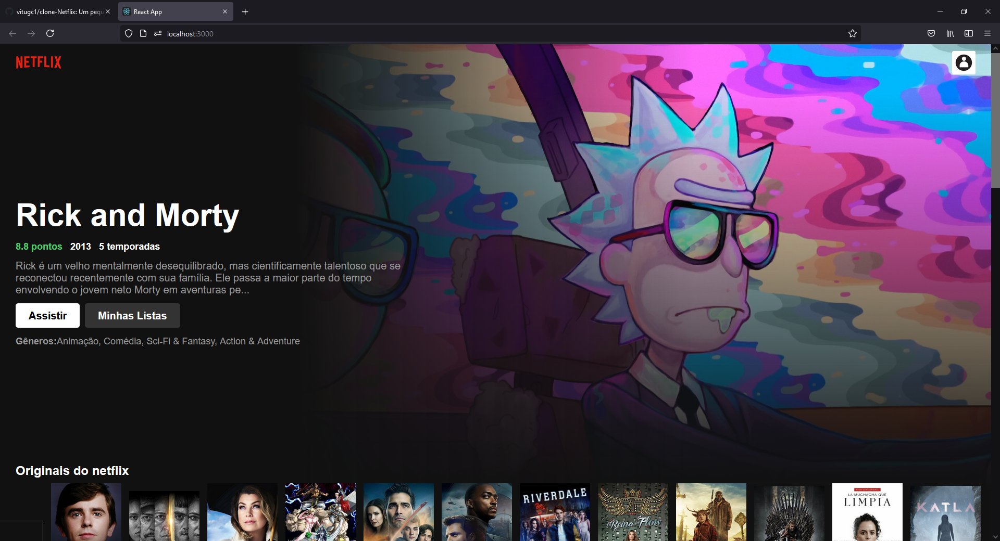

# INSTRUÇÃO PARA RODAR O PRJETO.
PASSO 1: Abra o terminal do VSCODE e digite "yarn", espere instalar. PASSO 2: Já instalado o yarn, digite "yarn start" é só esperar que o projeto irá abrir no navegador.

Caso queira abrir o projeto no terminal do PC, irá precisar té o (NODE.JS e YARN) instalado na máquina.

# DESCRIÇÃO DO PROJETO
O projeto e um clone da netflix, usei um api externa do https://www.themoviedb.org/ para extrair os dados

# PRINCIPAIS TECNOLOGIAS USADAS
### HTML
### CSS
### SASS
### JAVASCRIPT
### REACT

# IMAGEM DO PROJETO

